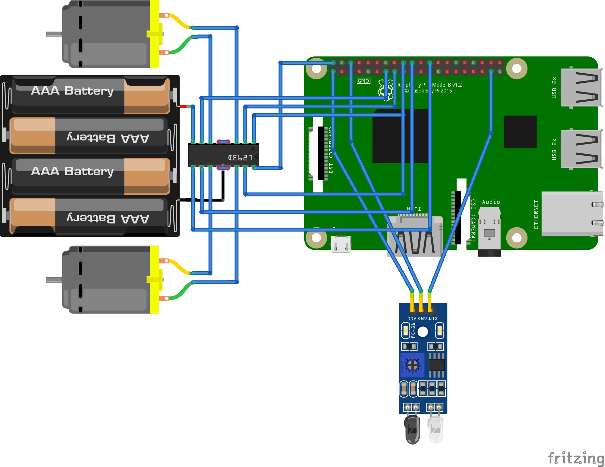
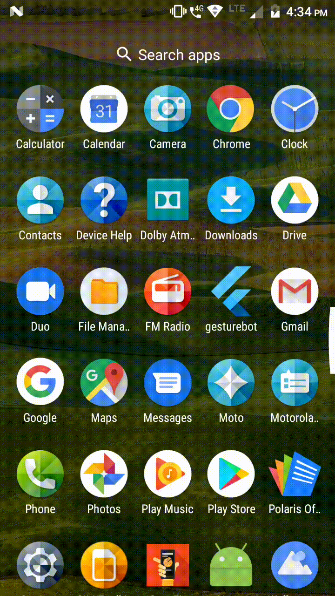

# GestureBot 🤖

> A gesture controlled robot built around a Raspberry Pi 3 and using mobile accelerometer sensors to recieve commands

## Tech Stack 👨‍💻

- Python
- Flutter and Dart
- Firebase

## Circuit Diagram

## Working

